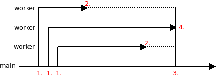
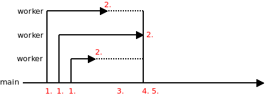
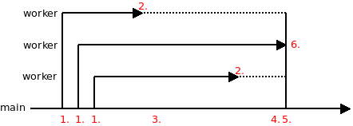
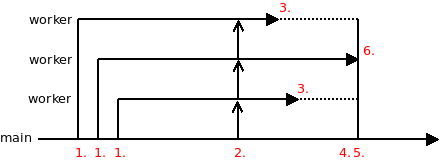

## What is concurrency?

Concurrency allows multiple functions to run independent of one another.

## How is concurrency implemented in libdill?

Functions that are meant to run concurrently must be annotated with the `coroutine` modifier.

```c
coroutine void foo(int arg1, const char *arg2);
```

To launch a coroutine, use the `go` keyword:

```c
go(foo(34, "ABC"));
```

Launching concurrent functions — or `coroutines`, in libdill terminology — using the `go` construct and switching between them is extremely fast. It requires only a few machine instructions. This makes coroutines a suitable basic flow control mechanism, not unlike the `if` or `while` keywords, which have comparable performance.

Coroutines have one big limitation, though: All  coroutines run on a single CPU core. If you want to take advantage of multiple cores, you have to launch multiple threads or processes, presumably as many of them as there are CPU cores on your machine.

Coroutines are scheduled cooperatively. What that means is that a coroutine has to explicitly yield control of the CPU to allow a different coroutine to run. In a typical scenario, this is done transparently to the user: When a coroutine invokes a function that would block (such as `msleep` or`chrecv`), the CPU is automatically yielded. However, if a coroutine runs without calling any blocking functions, it may hold the CPU forever. For these cases, the `yield` function can be used to manually relinquish the CPU to other coroutines manually.

## What is structured concurrency?

Structured concurrency means that lifetimes of concurrent functions are cleanly nested. If coroutine `foo` launches coroutine `bar`, then `bar` must finish before `foo` finishes.

This is not structured concurrency:


This is structured concurrency:


The goal of structured concurrency is to guarantee encapsulation. If the `main` function calls `foo`, which in turn launches `bar` in a concurrent fashion, `main` will be guaranteed that once `foo` has finished, there will be no leftover functions still running in the background.

What you end up with is a tree of coroutines rooted in the `main` function. This tree spreads out towards the smallest worker functions, and you may think of this as a generalization of the call stack — a call tree, if you will. In it, you can walk from any particular function towards the root until you reach the `main` function:


## How is structured concurrency implemented in libdill?

As with all idiomatic C, you have to do it by hand.

The good news is that it's easy.

The `go` construct returns a handle. The handle can be closed, and thereby kill the associated concurrent function.

```c
int h = go(foo());
do_work();
hclose(h);
```

What happens to a function that gets killed? It may have some resources allocated, and we want it to finish cleanly, without leaking those resources.

The mechanism is simple. In a function being killed by `hclose`, all blocking calls will start failing with the `ECANCELED` error. On one hand, this forces the function to finish quickly (there's not much you can do without blocking functions); on the other hand, it provides an opportunity for cleanup.

```c
coroutine void foo(void) {
    void *resource = malloc(1000);
    while(1) {
        int rc = msleep(now() + 100);
        if(rc == -1 && errno == ECANCELED) {
            free(resource);
            return;
        }
    }
}
```

## What about asynchronous objects?

Sometimes, instead of launching a coroutine, you may want to create an object that runs coroutines in the background.
For example, an object called `tcp_connection` may run two coroutines, one for asynchronously reading data from and one for asynchronously writing data to the network.

Still, it would be nice if the object was a node in the calltree, just like a coroutine is.

In other words, you may want a guarantee that once the object is deallocated there will be no leftover coroutines running:


And there's no trick there. Just do it in the most straightforward way. Launch the coroutines in the function that opens the object and close them in the function the closes the object. When the main function closes the connection object, both the sender and receiver coroutine will be stopped automatically.

```c
struct tcp_connection {
    int sender;
    int receiver;
}

void tcp_connection_open(struct tcp_connection *self) {
    self->sender = go(tcp_sender(self));
    self->receiver = go(tcp_receiver(self));
}

void tcp_connection_close(struct tcp_connection *self) {
    hclose(self->sender);
    hclose(self->receiver);
}
```

## What are the use cases?

WARNING: To keep examples in this section succint error handling was omitted.

#### Parent coroutine closes child coroutine

One coroutine launches another coroutine. At some point it decides to shut the child down irrespective of whether it have finished in the meantime or not. 

```c
coroutine void worker(void) {
    int rc = msleep(now() + 2000);
    if(rc < 0 && errno == ECANCELED) return; /* 4. */
    /* 2. */
}

int main(void) {
    int cr = go(worker()); /* 1. */
    msleep(now() + (random() % 1000));
    hclose(cr); /* 3. */
    return 0;
}
```

There are two possible scenarios. First, if the call to `random` returns a small number the child may finish before the parent calls `hclose`:


The worker coroutine finishes at the point 2. The stack of the coroutine is deallocated at that point. However, handle owned by the parent still points to a small "bundle" object. That object is deallocated later on at point 3.

Second, if the call to `random` return a big number the child won't finish before the parent and it will be forcefully terminated:


From point 3. on, all the blocking calls in the child coroutine start to return `ECANCELED` error. The call to `hclose()` won't finish until the worker coroutine exits. That should happen pretty fast given that it can't do any blocking calls anyway.

Note how in both scenarios the child gets an option to release any resources it may own (at points 2. and 4., respectively).

### Parent coroutine closes multiple child coroutines

This is basically the same scenario as above except that mutliple child coroutines are launched instead of a single one.

```c
coroutine void worker(void) {
    int rc = msleep(now() + (random() % 1000));
    if(rc < 0 && errno == ECANCELED) {
        return; /* 4. */
    }
    /* 2. */
}

int main(void) {
    int b = bundle();
    int i;
    for(i = 0; i != 3; i++)
        bundle_go(b, worker()); /* 1. */
    msleep(now() + 500);
    hclose(b); /* 3. */
    return 0;
}
```

Each child either finishes before the main coroutine or it is canceled by the main coroutine, just as above.



The only difference is that all the child coroutines are referred to using a single handle. Therefore there are no dangling leftover handles as individual children finish.

#### Parent coroutine waits for child coroutine

In this use case, child coroutine does a computation. At some point, parent coroutine needs the result of the computation. It waits until the child coroutine is finished and retrieves the result.

```c
coroutine void worker(int ch) {
    msleep(now() + (random() % 2000));
    /* 2. */
    int val = 42;
    chsend(ch, &val, sizeof(val), -1); /* 3. */
    /* 3. */
}

int main(void) {
    int ch[2];
    chmake(ch);
    int cr = go(worker(ch[1])); /* 1. */
    msleep(now() + 1000);
    /* 4. */
    int val;
    chrecv(ch[0], &val, sizeof(val), -1);
    /* 5. */
    hclose(cr); /* 6. */
    return 0;
}
```

Once again, there are two possible scenarios. First, the child may have finished quickly:


The child is done with the computation at point 2. It tries to send the result into the channel. However, nobody is yet reading from the channel and so the call is blocked until the parent coroutine reads from the channel at point 4.

Alternatively, the child coroutine may still be running when the parent needs the result:


Parent tries to read the result from the channel at point 4. and gets stuck. When the child finishes the computation at point 2. the parent gets unstuck and proceeds to closing the child at point 6.

#### Parent coroutine waits for child coroutine - with a grace period

Same as above but the parent limit the time it is waiting for the result from the child. If result is not received when the deadline hits it will cancel the child.

The code is exactly the same as in the previous scenario, except that `chrecv` now has a deadline:

```c
coroutine void worker(int ch) {
    int rc = msleep(now() + (random() % 2000));
    if(rc < 0 && errno == ECANCELED) return; /* 7. */
    /* 2. */
    int val = 42;
    chsend(ch, &val, sizeof(val), -1);
    /* 3. */
}

int main(void) {
    int ch[2];
    chmake(ch);
    int cr = go(worker(ch[1])); /* 1. */
    msleep(now() + 1000);
    /* 4. */
    int val;
    int rc = chrecv(ch[0], &val, sizeof(val), now() + 500);
    if(rc < 0 && errno == ETIMEDOUT) {
        printf("Timed out\n"); /* 5a. */
    } else {
        printf("Success\n"); /* 5. */
    }
    hclose(cr); /* 6. */
    return 0;
}
```

There are three possible scenarios in this use cases. The first two are identical to those in the previous use case.

The third one occurs when the child coroutine is not finished by the end of the grace period:


Parent start waiting for the child at point 4. `chrecv` times out at point 5a. The child coroutine is closed forcefully just after that, at point 6.

#### Parent coroutine closes multiple child coroutines - with a grace period

This is a common scenario in network servers. Imagine that the main coroutine is accepting connections and launching one child coroutine per connection. When shutting down the server you want it to stop accepting new connections, but at the same time you want to give all the connections currently in-flight some time to finish whatever it is they are doing. However, you don't want to wait for too long. If some connections don't finish within reasonable time you want to cancel them.

```c
coroutine void worker(void) {
    int rc = msleep(now() + (random() % 1000));
    if(rc < 0 && errno == ECANCELED) {
        return; /* 6 . */
    }
    /* 2. */
}

int main(void) {
    int b = bundle();
    int i;
    for(i = 0; i != 3; i++)
        bundle_go(b, worker()); /* 1. */
    /* 3. */
    hdone(b, now() + 500);
    /* 4. */
    hclose(b); /* 5. */
    return 0;
}
```

There are two scenarios worth considering. First, all the children can end before the deadline expires. In that case `hdone()` exits immediately after the last child is finished (point 4.):



In the second scenario, there are still some children running when deadline is reached. `hdone()` exits with `ETIMEDOUT` at point 4. The remaining coroutines are canceled at point 5. 



#### Parent coroutine broadcast a shutdown signal to children

Consider the previous use case except that the child coroutines are doing work in an infinite loop. Giving them grace period to finish doesn't make sense. They are not going to finish on their own, ever.

What we would like to do instead is to boradcast a "shutdown" signal to all of them. Once they receive the signal they'll finish whatever it is they are doing and exit the infinite loop. The parent will give them grace period to do so. After grace period is over it will forefully cancel all children that are still running.

Generally speaking, libdill channels are not capable of broadcasting messages. However, they can broadcast a simple signal. If `hdone()` is called on one end of a channel, any subsequent attempt to read a message from the other end is going to fail with `EPIPE` error. If there are multiple coroutines receiving from the channel, they are all going to get `EPIPE` error. This is, for all practical purposes, equivalent to broadcasting a signal. 

```c
coroutine void worker(int ch) {
    while(1) {
        int rc = msleep(now() + (random() % 1000));
        if(rc < 0 && errno == ECANCELED) {
            return; /* 6. */
        }
        rc = chrecv(ch, NULL, 0, 0);
        if(rc == -1 && errno == EPIPE) {
            return; /* 3. */
        }
    }
}

int main(void) {
    int ch[2];
    chmake(ch);
    int b = bundle();
    int i;
    for(i = 0; i != 3; i++)
        bundle_go(b, worker(ch[0])); /* 1. */
    msleep(now() + 5000);
    hdone(ch[1], -1); /* 2. */
    rc = hdone(b, now() + 1000);
    if(rc < 0 && errno == ETIMEDOUT) {
        /* 4. */
    }
    hclose(b); /* 5. */
    hclose(ch[1]);
    hclose(ch[0]);
    return 0;
}
```



At point 2. the main coroutine broadcasts the "shutdown" signal to worker coroutines. Then it starts waiting for coroutines to finish. The first and the third worker coroutine manage to finish in time. The second worker coroutine, on the other hand, carries on until the deadline in the main coroutine expires (point 4). The main cooutine then cancels is forcefully (point 5).
